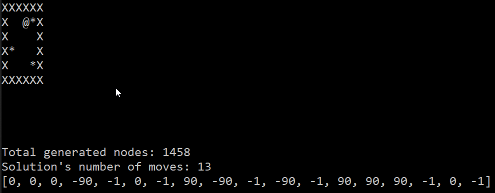

# Advanced Robotics - Group 3

- _ITU - Advanced Robotics course_

**Team members:**

- Balázs Tóth (balazs.toth818@gmail.com)
- Boris Karavasilev (karavasilev.boris@gmail.com)
- Michele Imbriani (imbr.mic@gmailc.com)

Sokoban solver that generates a solution that a physical robot can follow.
To run the solver:

```cmd
> python solve_map.py
```

To upload the micro python code to the LEGO EV3 robot install the LEGO Mindstorms extension and press Ctr+f5 in VS Code.

## Solver output example:



[👉 Video of the real robot 👈](https://youtu.be/fp0sEyfc36w)
